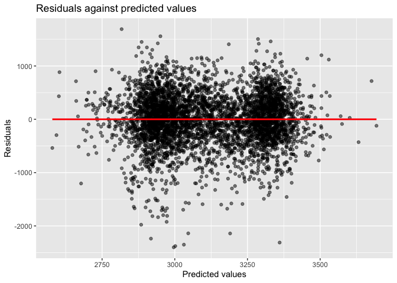
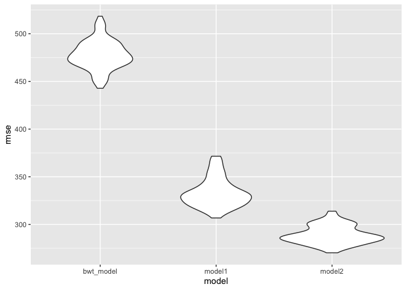

p8105\_hw6\_sc4935
================
Shiwei Chen
12/3/2021

# Problem 1

Load and clean the data for regression analysis

``` r
# convert numeric to factor where appropriate
childbwt_tidy = read_csv("./data/birthweight.csv") %>% 
  janitor::clean_names() %>%
  mutate(
    babysex = as.factor(babysex),
    frace = as.factor(frace),
    malform = as.factor(malform),
    mrace = as.factor(mrace)
  )
```

    ## Rows: 4342 Columns: 20

    ## ── Column specification ────────────────────────────────────────────────────────
    ## Delimiter: ","
    ## dbl (20): babysex, bhead, blength, bwt, delwt, fincome, frace, gaweeks, malf...

    ## 
    ## ℹ Use `spec()` to retrieve the full column specification for this data.
    ## ℹ Specify the column types or set `show_col_types = FALSE` to quiet this message.

``` r
childbwt_tidy
```

    ## # A tibble: 4,342 × 20
    ##    babysex bhead blength   bwt delwt fincome frace gaweeks malform menarche
    ##    <fct>   <dbl>   <dbl> <dbl> <dbl>   <dbl> <fct>   <dbl> <fct>      <dbl>
    ##  1 2          34      51  3629   177      35 1        39.9 0             13
    ##  2 1          34      48  3062   156      65 2        25.9 0             14
    ##  3 2          36      50  3345   148      85 1        39.9 0             12
    ##  4 1          34      52  3062   157      55 1        40   0             14
    ##  5 2          34      52  3374   156       5 1        41.6 0             13
    ##  6 1          33      52  3374   129      55 1        40.7 0             12
    ##  7 2          33      46  2523   126      96 2        40.3 0             14
    ##  8 2          33      49  2778   140       5 1        37.4 0             12
    ##  9 1          36      52  3515   146      85 1        40.3 0             11
    ## 10 1          33      50  3459   169      75 2        40.7 0             12
    ## # … with 4,332 more rows, and 10 more variables: mheight <dbl>, momage <dbl>,
    ## #   mrace <fct>, parity <dbl>, pnumlbw <dbl>, pnumsga <dbl>, ppbmi <dbl>,
    ## #   ppwt <dbl>, smoken <dbl>, wtgain <dbl>

``` r
# check for missing data
check_na = childbwt_tidy %>% 
  map(~ sum(is.na(.)))

check_na
```

    ## $babysex
    ## [1] 0
    ## 
    ## $bhead
    ## [1] 0
    ## 
    ## $blength
    ## [1] 0
    ## 
    ## $bwt
    ## [1] 0
    ## 
    ## $delwt
    ## [1] 0
    ## 
    ## $fincome
    ## [1] 0
    ## 
    ## $frace
    ## [1] 0
    ## 
    ## $gaweeks
    ## [1] 0
    ## 
    ## $malform
    ## [1] 0
    ## 
    ## $menarche
    ## [1] 0
    ## 
    ## $mheight
    ## [1] 0
    ## 
    ## $momage
    ## [1] 0
    ## 
    ## $mrace
    ## [1] 0
    ## 
    ## $parity
    ## [1] 0
    ## 
    ## $pnumlbw
    ## [1] 0
    ## 
    ## $pnumsga
    ## [1] 0
    ## 
    ## $ppbmi
    ## [1] 0
    ## 
    ## $ppwt
    ## [1] 0
    ## 
    ## $smoken
    ## [1] 0
    ## 
    ## $wtgain
    ## [1] 0

Propose a regression model for birthweight.

``` r
bwt_model = lm(bwt ~ fincome + frace + malform + momage + mrace + ppbmi + smoken, data = childbwt_tidy)

summary(bwt_model)
```

    ## 
    ## Call:
    ## lm(formula = bwt ~ fincome + frace + malform + momage + mrace + 
    ##     ppbmi + smoken, data = childbwt_tidy)
    ## 
    ## Residuals:
    ##      Min       1Q   Median       3Q      Max 
    ## -2401.44  -275.05    13.08   305.17  1690.77 
    ## 
    ## Coefficients:
    ##              Estimate Std. Error t value Pr(>|t|)    
    ## (Intercept) 2864.9341    63.6508  45.010  < 2e-16 ***
    ## fincome        0.6562     0.3135   2.093  0.03639 *  
    ## frace2       -97.8789    80.9258  -1.209  0.22654    
    ## frace3       -32.6272   121.6781  -0.268  0.78860    
    ## frace4       -92.6185    78.4022  -1.181  0.23754    
    ## frace8       -10.3279   130.0731  -0.079  0.93672    
    ## malform1     -17.7155   123.9293  -0.143  0.88634    
    ## momage         1.8559     2.0823   0.891  0.37283    
    ## mrace2      -251.7730    80.8060  -3.116  0.00185 ** 
    ## mrace3      -105.5302   126.1243  -0.837  0.40280    
    ## mrace4      -155.2389    78.8786  -1.968  0.04912 *  
    ## ppbmi         18.4932     2.3178   7.979 1.87e-15 ***
    ## smoken       -11.2936     1.0169 -11.106  < 2e-16 ***
    ## ---
    ## Signif. codes:  0 '***' 0.001 '**' 0.01 '*' 0.05 '.' 0.1 ' ' 1
    ## 
    ## Residual standard error: 478.6 on 4329 degrees of freedom
    ## Multiple R-squared:  0.1291, Adjusted R-squared:  0.1267 
    ## F-statistic: 53.48 on 12 and 4329 DF,  p-value: < 2.2e-16

``` r
coef(bwt_model)
```

    ## (Intercept)     fincome      frace2      frace3      frace4      frace8 
    ## 2864.934064    0.656172  -97.878854  -32.627200  -92.618468  -10.327879 
    ##    malform1      momage      mrace2      mrace3      mrace4       ppbmi 
    ##  -17.715538    1.855917 -251.772956 -105.530175 -155.238899   18.493226 
    ##      smoken 
    ##  -11.293619

``` r
bwt_model %>% 
   broom::tidy() %>% 
   knitr::kable(digits = 3)
```

| term        | estimate | std.error | statistic | p.value |
|:------------|---------:|----------:|----------:|--------:|
| (Intercept) | 2864.934 |    63.651 |    45.010 |   0.000 |
| fincome     |    0.656 |     0.313 |     2.093 |   0.036 |
| frace2      |  -97.879 |    80.926 |    -1.209 |   0.227 |
| frace3      |  -32.627 |   121.678 |    -0.268 |   0.789 |
| frace4      |  -92.618 |    78.402 |    -1.181 |   0.238 |
| frace8      |  -10.328 |   130.073 |    -0.079 |   0.937 |
| malform1    |  -17.716 |   123.929 |    -0.143 |   0.886 |
| momage      |    1.856 |     2.082 |     0.891 |   0.373 |
| mrace2      | -251.773 |    80.806 |    -3.116 |   0.002 |
| mrace3      | -105.530 |   126.124 |    -0.837 |   0.403 |
| mrace4      | -155.239 |    78.879 |    -1.968 |   0.049 |
| ppbmi       |   18.493 |     2.318 |     7.979 |   0.000 |
| smoken      |  -11.294 |     1.017 |   -11.106 |   0.000 |

Describe your modeling process

Show a plot of model residuals against fitted values

``` r
childbwt_tidy %>% 
  modelr::add_predictions(bwt_model) %>% 
  modelr::add_residuals(bwt_model) %>% 
  ggplot(aes(x = pred, y = resid)) + 
  geom_point(alpha = .5) + 
  geom_smooth(method = "lm", color = "red", se = FALSE) +
  labs(
    x = "Predicted values",
    y = "Residuals",
    title = "Residuals against predicted values"
  )
```

    ## `geom_smooth()` using formula 'y ~ x'

<!-- -->

Compare your model to two others

``` r
# One using length at birth and gestational age as predictors(main effects only)
model1 = lm(bwt ~ blength + gaweeks, data = childbwt_tidy) %>% 
  broom::tidy() 
  
# One using head circumference, length, sex, and all interactions(including the three-way interaction) between these
model2 = lm(bwt ~ babysex * blength * bhead, data = childbwt_tidy) %>% 
  broom::tidy() 
```

Make this comparison in terms of the cross-validated prediction error

``` r
cv_df = 
  crossv_mc(childbwt_tidy, 100)

cv_df %>% pull(train) %>% .[[1]] %>% as_tibble
```

    ## # A tibble: 3,473 × 20
    ##    babysex bhead blength   bwt delwt fincome frace gaweeks malform menarche
    ##    <fct>   <dbl>   <dbl> <dbl> <dbl>   <dbl> <fct>   <dbl> <fct>      <dbl>
    ##  1 2          34      51  3629   177      35 1        39.9 0             13
    ##  2 1          34      52  3062   157      55 1        40   0             14
    ##  3 2          34      52  3374   156       5 1        41.6 0             13
    ##  4 1          33      52  3374   129      55 1        40.7 0             12
    ##  5 2          33      46  2523   126      96 2        40.3 0             14
    ##  6 2          33      49  2778   140       5 1        37.4 0             12
    ##  7 1          36      52  3515   146      85 1        40.3 0             11
    ##  8 1          33      50  3459   169      75 2        40.7 0             12
    ##  9 2          35      51  3317   130      55 1        43.4 0             13
    ## 10 1          35      51  3459   146      55 1        39.4 0             12
    ## # … with 3,463 more rows, and 10 more variables: mheight <dbl>, momage <dbl>,
    ## #   mrace <fct>, parity <dbl>, pnumlbw <dbl>, pnumsga <dbl>, ppbmi <dbl>,
    ## #   ppwt <dbl>, smoken <dbl>, wtgain <dbl>

``` r
cv_df %>% pull(test) %>% .[[1]] %>% as_tibble
```

    ## # A tibble: 869 × 20
    ##    babysex bhead blength   bwt delwt fincome frace gaweeks malform menarche
    ##    <fct>   <dbl>   <dbl> <dbl> <dbl>   <dbl> <fct>   <dbl> <fct>      <dbl>
    ##  1 1          34      48  3062   156      65 2        25.9 0             14
    ##  2 2          36      50  3345   148      85 1        39.9 0             12
    ##  3 2          35      48  3175   158      75 1        39.7 0             13
    ##  4 1          36      53  3629   147      75 1        41.3 0             11
    ##  5 1          35      56  3232   147      55 1        42.1 0             13
    ##  6 1          36      54  3402   161      95 1        40.1 0             11
    ##  7 1          35      52  3232   121      75 3        42.3 0             13
    ##  8 1          33      51  3345   140      85 1        38.6 0             13
    ##  9 1          34      52  3118   130      75 1        41   0             12
    ## 10 2          34      51  3203   132      85 1        43.7 0             13
    ## # … with 859 more rows, and 10 more variables: mheight <dbl>, momage <dbl>,
    ## #   mrace <fct>, parity <dbl>, pnumlbw <dbl>, pnumsga <dbl>, ppbmi <dbl>,
    ## #   ppwt <dbl>, smoken <dbl>, wtgain <dbl>

``` r
cv_df =
  cv_df %>%
  mutate(
    train = map(train, as_tibble),
    test = map(test, as_tibble))

cv_df = 
  cv_df %>% 
  mutate(
    bwt_model = map(train, ~lm(bwt ~ fincome + frace + malform + momage + mrace + ppbmi + smoken, data = .x)),
    model1 = map(train, ~lm(bwt ~ blength + gaweeks, data = .x)),
    model2 = map(train, ~lm(bwt ~ babysex * blength * bhead, data = .x))
    ) %>% 
  mutate(
    rmse_bwt_model = map2_dbl(bwt_model, test, ~rmse(model = .x, data = .y)),
    rmse_model1 = map2_dbl(model1, test, ~rmse(model = .x, data = .y)),
    rmse_model2 = map2_dbl(model2, test, ~rmse(model = .x, data = .y))
    )
```

``` r
cv_df %>% 
  select(starts_with("rmse")) %>% 
  pivot_longer(
    everything(),
    names_to = "model", 
    values_to = "rmse",
    names_prefix = "rmse_") %>% 
  mutate(model = fct_inorder(model)) %>% 
  ggplot(aes(x = model, y = rmse)) + geom_violin()
```

<!-- -->
